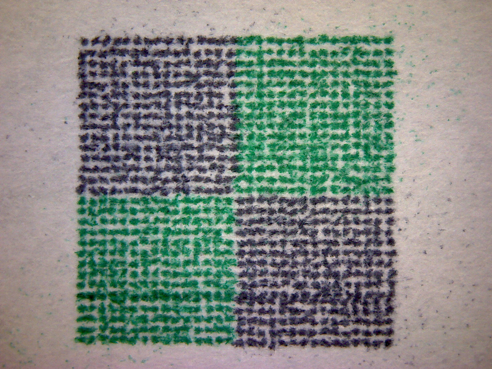

# Image to gcode
Converts an image file to gcode.




## Project Rational
Typically printers will use color overlap to give the appearance of color gradients and continuity. This script is designed to avoid overlap for experiments requiring isolated or precisely located depositions.

### Example applications
* Bacteria deposition
* Circuit board etch resist
* Circuit construction

## Compatible Firmwares
### Marlin
Use this branch for HPC6602 compatibility with the inkshield.
https://github.com/sjkelly/Marlin/tree/hpc6602

## Install
On a Ubuntu or Debian system, the dependencies can be installed with the lines below.

**From apt:**
```
sudo apt-get install python-opencv
```

**From pip:** (Use `sudo apt-get install python-pip` to get pip)
```
sudo pip install ast
sudo pip install termcolor
```

## How to use
You can execute the script by running `python image_to_gcode.py` in your terminal.

```
usage: image_to_gcode.py [options] input...

Convert bitmaps to gcode.

positional arguments:
  input                 input file, defaults to stdin

optional arguments:
  -h, --help            show this help message and exit
  -o OUTPUT, --output OUTPUT
                        Output file, defaults to stdout
  -s SPREAD, --spread SPREAD
                        Nozzle spread (mm). Default: 3.175
  -n NOZZLES, --nozzles NOZZLES
                        Nozzle count. Default: 12
  -a AREA, --area AREA  Print area in millimeters. Default: [200, 200]
  -f FEEDRATE, --feedrate FEEDRATE
                        Print feedrate. Default: 1000
  --version             show program's version number and exit
  -r RED, --red RED     Head offset in millimeters. Default: [0, 0]
  -g GREEN, --green GREEN
                        Head offset in millimeters. Default: [30.5, 0.1]
  -b BLUE, --blue BLUE  Head offset in millimeters. Default: [0, 0]
  -k BLACK, --black BLACK
                        Head offset in millimeters. Default: [0, 0]
```

### Outputs
Since the implementation in Marlin is very simple, the output gcode needs to take into account some behaviors. Primarily these considerations are around move buffering. Since nozzle commands are not buffered, an `M400` command is sent between a movement and a fire command as shown below.

```
G1X0.0Z0.0F10000
M400
M700 P0 S3075
```

The `G1X0.0Z0.0F10000` indicates a move to the 0.0 location in the X axis, and 0.0 location in the Z axis at a feedrate of 100000 mm/min. The following `M400` command tells the printer firmware to wait for all moves to complete before executing the next command. Last, the `M700 P0 S3075` command tells the printer to fire the zeroth print head nozzles with the pattern 110000000011. The number following the 'S' is the decimal representation of the binary number indicating which nozzles to fire.

## About
This project was started at AMRI at Rice University in August 2013.

## License
See LICENSE.txt

